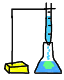
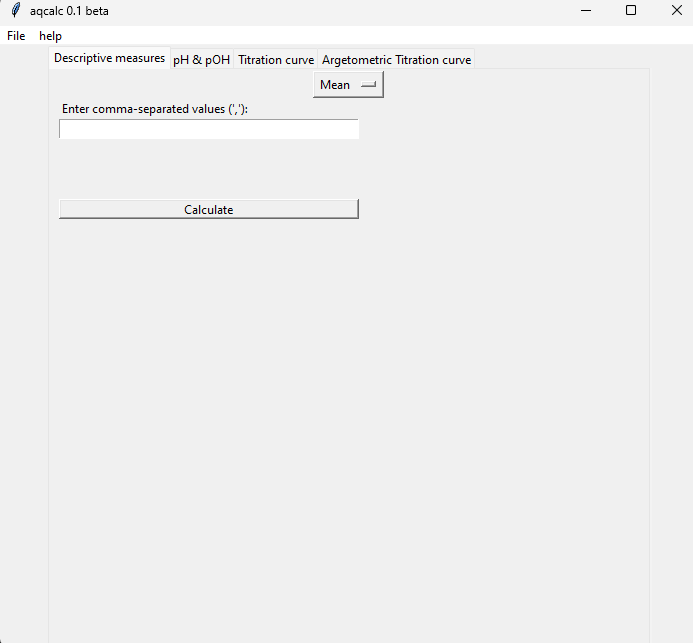

<head>
    
</head>

# AQCALC
Version 0.1 beta
#### Languages
This page is available in the following languages: 
[English](#what-is-aqcalc)
[Português](#o-que-é-aqcalc)

## What is Aqcalc?
Aqcalc is a specific calculator for carrying out specific scientific calculations for quantitative analytical chemistry, with several specific features such as calculating descriptive measurements, calculating pH and pOH, acid-base titration curves and argentinometry.

## License
This software is registered under <a href='https://www.gnu.org/licenses/gpl-3.0.en.html'>GPL 3.0</a>

## Resources
### Finished
* Mean
* Deviation from an average
* Standard deviation
* Relative standard deviation
* Confidence Threshold
* Calculate pH and pOH
* Generate titration curves of acid-base reactions
* Generate titration curves of preciptation reactions
* Unit converter
* Calculate molarity
* Calculate Analitical Factor
* A table with acid and base constants values

### Pending
* Portuguese language translation
* Dark mode

## Minimum Requirements
* Operationg system:
    * Windows 10 or later
    * Ubuntu 18.04 or later
* 4gb RAM
* 2 cores processor

## How to install
### Microsoft Windows
1. Download the file "aqcalc-0.1-win-beta.zip" on releases section
2. Extract the files to desired folder
3. Double click on init.exe

### Linux Ubuntu/Debian
1. Download the file "aqcalc-0.1-linux-beta.tar.gz" on releases section
2. Extract the files with command   <code>tar  -xvf aqcalc-linux-0.1.tar.gz</code>
3.  Give execute permissions to the init file   <code>sudo chmod +x init</code>
4. Execute the program using the command <code>./init</code> or  double-click the init file

## How to use
When opening Aqcalc you will come across the following window: 
 
In the top bar, there are only two options: 
* File:
     * close: Closes the program
* Help:
     * About: Information about the program and an access link to this documentation

In the top corner, there are several tabs, where all the features that this application is capable of are listed.

Among these features we have:
* Descriptive measures
     * <b>Arithmetic mean:</b>  Calculates the arithmetic mean of the values entered.
     * <b>Deviation of a Measument:</b> Calculates the deviation from the average of the values entered. Returns the individual deviation of each value and the average between the deviations highlighted in blue.
     * <b>Standard deviation:</b> Returns the standard deviation and relative standard deviation of the entered values
     * <b>Trust threshold:</b> Calculates the trust threshold. Two parameters are used:
         * A list of values (range)
         * T value (probability percentage)
* Calculate pH and pOH:
     * <b>Strong acid and strong base reaction</b>, uses 4 parameters:
         * <b>Acid volume</b> Volume in mL of a strong acid
         * <b>Volume of base</b> Volume of a strong base in mL
         * <b>Acid concentration</b> Molar concentration of the acid in mol/L
         * <b>Base concentration</b> Molar base concentration in mol/L
     * <b>Weak acid and strong base reaction</b>, 5 parameters are used:
         * <b>Acid volume</b>, volume of a weak acid given in mL
         * <b>Base volume</b> , volume of a strong base given in mL
         * <b>Acid concentration</b>, Concentration of an acid
         * <b>Base concentration</b> 
         * <b>Acid constant (Ka)</b>, within this parameter there are 2 values:
             * Coefficient
             * Exponential
     * <b>Strong acid and weak base reaction</b>, uses the same principle as the previous item, where 5 parameters are assigned:
         * <b>Volume of strong acid</b>, in mL
         * <b>Volume of weak base</b>, in mL
         * <b>Strong acid concentration</b>, in mol/L
         * <b>Weak base concentration</b>, in mol/L
         * <b>Base constant (Kb)</b>, two parameters are used:
             * Coefficient
             * Exponential
     * <b>Weak acid and weak base reaction</b>, uses as parameters:
         * <b>Volume of weak acid</b>, in mL
         * <b>Volume of weak base</b>, in mL
         * <b>Weak acid concentration</b>, in mol/L
         * <b>Weak base concentration</b>, in mol/L
         * <b>Acid constant (Ka):</b>
             * Coefficient
             * Exponential
         * <b>Base constant (kb):</b>
             * Coefficient
             * Exponential
* <b>Acid-base titration curve</b>
     * <b>Strong acid titration</b>, uses 3 parameters:
         * Volume of acid in mL
         * Acid concentration (in N)
         * Base concentration (in N)
     * <b>Strong base titration</b>, like the previous item, uses 3 parameters:
         * Base volume in mL
         * Concentration of the acid in N
         * Base concentration in N
     * <b>Titration of weak acid with strong base</b>, uses 5 parameters:
         *Initial volume in mL
         * Acid dissolution constant, calculated from the parameters:
             * Coefficient
             * Exponential
         * Concentration of the acid in N
         * Base concentration in N
         * Valence of the acid
     * <b>Titration of weak base with strong acid</b>, is based on the same principle as the previous item
* <b>Argentimetric titration curve:</b>, uses as parameters:
     * Volume of analyte, in mL
     * Titrant volume in mL
     * Analyte concentration, in mol/L
     * Titrant concentration in mol/L

<!--Seção-em-português-->
## O que é Aqcalc?
Aqcalc é uma calculadora específica voltada para a realização de cálculos científicos voltados para a química analítica quantitativa, contando com diversos recursos específicos como calcular medidas descritivas, cálculo de pH e pOH, curvas de titulação ácido-base e argentinometria.

## Licença
Este software está sob licença <a href='https://www.gnu.org/licenses/gpl-3.0.en.html'>GPL 3.0</a>

## Recursos
### Finalizado
* Média aritimética
* Desvio de uma média
* Desvio padrão
* Desvio padrão relativo
* Limite de confiança
* Cálculo de pH and pOH
* Geração de curva de titulação para reações ácido-base
* Gerar curvas de titulação para reações de precipitação
* Conversor de unidades
* Calcular molaridade
* Calcular fator analítico
* Uma tabela com os valores das constantes de ácidos e bases

### Pendente
* Tradução para o idioma português
* Modo escuro

## Requisitos mínimos
* Sistema operacional:
    * Windows 10 ou superior
    * Ubuntu 18.04 ou superior
* 4 gb de memória RAM
* Processador de 2 núcleos

## Como instalar
### Microsoft Windows
1.	Baixar o arquivo "aqcalc-0.1-win-beta.zip" na seção releases
2.	Extrair os arquivos para a pasta desejada
3.	Dê um dublo clique no arquivo init.exe
<h5>Obs. O Windows Defender (ou qualquer antivírus instalado) pode reconhecer o aplicativo como um programa suspeito</h5>

### Linux Ubuntu/Debian
1. Baixar o arquivo "aqcalc-0.1-linux-beta.tar.gz" na seção releases
2. Extraia os arquivos com o comando   <code>tar  -xvf aqcalc-linux-0.1.tar.gz</code>
3. Dê permissões de execução para o arquivo init   <code>sudo chmod +x init</code>
4. Execute o programa usando o comando <code>./init</code> ou dê um duplo clique no arquivo init

## Como usar
Ao abrir o Aqcalc você irá se deparar com a seguinte janela: 
 
Na barra superior, existem apenas duas opções: 
* File(Arquivo):
    * Exit (fechar): Encerra o programa
* Help (Ajuda):
    * About (sobre): Informações sobre o programa e um link de acesso para esta documentação

No canto superior, há várias abas, onde estão listados todos os recursos que este aplicativo é capaz de fazer
    <h5>Obs. Para números decimais, utilize como separador ponto (.) e não vírgula (,). Pois a vírgula é utilizada como um separador entre os números.</h5>
Dente esses recursos temos:
* Medidas descritivas
    * <b>Mean (média aritimética):</b>  Calcula a média aritimética dos valores inseridos.
    * <b>Deviation of a Measument (Desvio de uma média):</b> Calcula o desvio da média dos valores inseridos. Retorna o desvio individual de cada valor e a média entre os devios destacado de azul.
    * <b>Standard deviation(Desvio padrão):</b> Retorna o desvio padrão e desvio padrão relativo dos valores inseridos
    * <b>Trust threshold:</b> Calcula o limite de confiança. São utilizados dois parâmetros:
        * Uma lista de valores (intervalo)
        * Valor de T (percentual de probabilidade)
* Calcular pH e pOH:
    * <b>Reação ácido forte e base forte</b>, utiliza 4 parâmetros:
        * <b>Volume do ácido</b> Volume em mL de um ácido forte
        * <b>Volume da base</b> Volume de uma base forte em mL
        * <b>Concentração do ácido</b> Concentração molar do ácido em mol/L
        * <b>Concentração da base</b> Concentração molar da base em mol/L
    * <b>Reação ácido fraco e base forte</b>, são utilizados 5 parâmetros:
        * <b>Volume do ácido</b>, volume de um ácido fraco dado em mL
        * <b>Volume da base</b> , volume de uma base forte dado em mL
        * <b>Concentração do ácido</b>, Concentração de um ácido 
        * <b>Concentração da base</b> 
        * <b>Constante do ácido (Ka)</b>, dentro desse parâmetro há a presença de 2 valores:
            * Coeficiente
            * Exponencial
    * <b>Reação ácido forte e base fraca</b>, utiliza o mesmo princípio do item anterior, onde são atribuídos 5 parâmetros:
        * <b>Volume do ácido forte</b>, em mL
        * <b>Volume da base fraca</b>, em mL
        * <b>Concentração do ácido forte</b>, em mol/L
        * <b>Concetração da base fraca</b>, em mol/L
        * <b>Constante da base (Kb)</b>, utiliza-se dois parâmetros:
            * Coeficente
            * Exponencial
    * <b>Reação ácido fraco e base fraca</b>, utiliza como parâmetros: 
        * <b>Volume do ácido fraco</b>, em mL
        * <b>Volume da base fraca</b>, em mL
        * <b>Concentração do ácido fraco</b>, em mol/L
        * <b>Concentração da base fraca</b>, em mol/L
        * <b>Constante do ácido (Ka):</b>
            * Coeficiente
            * Exponencial
        * <b>Constante da base (kb):</b>
            * Coeficente
            * Exponencial
* <b>Curva de titulação ácido-base</b>
    * <b>Titulação de ácido forte</b>, utiliza 3 parâmetros:
        * Volume do ácido em mL
        * Concentração do ácido (em N)
        * Concentração da base (em N)
    * <b>Titulação de base forte</b>, assim como item anterior, utiliza 3 parâmetros:
        * Volume da base em mL
        * Concentração do ácido em N
        * Concentração da base em N
    * <b>Titulação de ácido fraco com base forte</b>, utiliza 5 parâmetros:
        * Volume inicial em mL
        * Constante de dissolução do ácido, calculado a partir dos parâmetros:
            * Coeficiente
            * Exponencial
        * Concentração do ácido em N
        * Concentração da base em N
        * Valência do ácido
    * <b>Titulação de base fraca com ácido forte</b>, se baseia no mesmo princípio do item anterior
* <b>Curva de titulação Argentimétrica:</b>, utiliza como parâmetros:
    * Volume do analito, em mL
    * Volume do titulante em mL
    * Concentração do analito, em mol/L
    * Concentração do titulante em mol/L